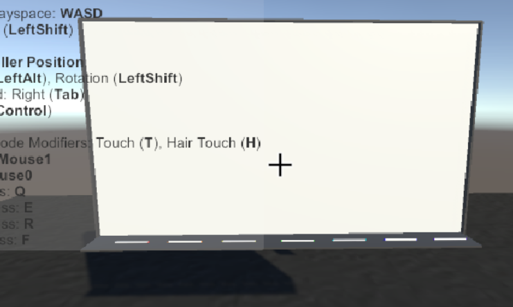
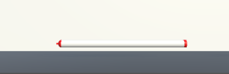
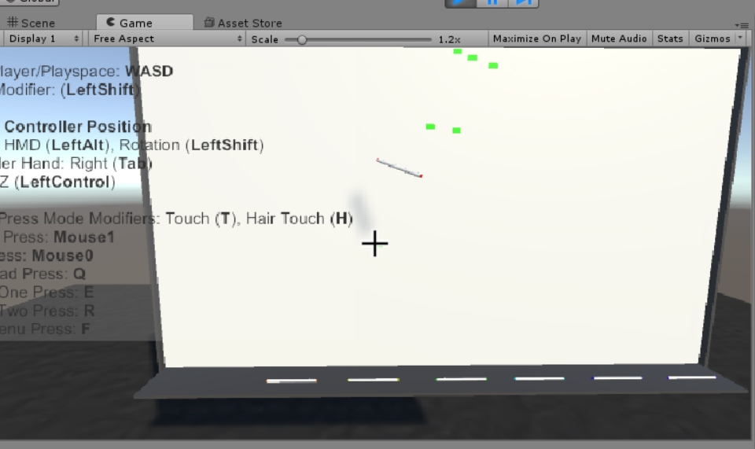
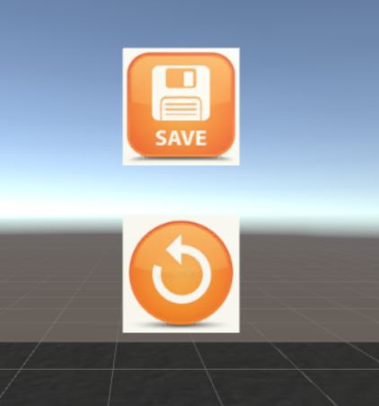

## VR端设计

### 设计考虑
在开题报告中我们考虑到，用户在三维空间中更方便进行三维的绘图，于是决定使用tilt brush在unity中进行开发。但在实践阶段遇到了两个问题：
1.  tilt brush 相关教程较少，他更多是一个开发好了的绘图工具，与unity整合在一起获取画出的模型资源有难度。
2. 在开题阶段就发现的，三维模型的绘制会出现从不同视角看过去差别较大的情况。考虑到大部分未经过训练的用户更习惯于普通的在画纸上进行二维创作的习惯，在实践中也会习惯在三维空间里画二维图像（也就是物体的主视图）。而此时二维图像的线段容易不在一个平面内，考虑过的多视图加权计算思路操作起来并不容易。（此处加图）

综合以上考虑，为了在中期能够收获一个实验结果，在VR端的设计上做出了改动：在空间中固定一个画板，为用户提供一个可参考的二维平面，然后提供画笔让用户进行绘画。

### 设计思路
定义了一个黑板（在场景中建一个Quad）和许多画笔。画笔的设计上有些复杂，分为笔的头、尾（控制握笔的方向）还有笔尖（用来绘画）。在画笔触碰到黑板时触发函数记录画笔此刻的位置并将此处的像素点设置颜色，然后实时更新黑板面的texture来显示绘画图案。（画笔图、黑板图、绘制图）



- 关于像素点绘制：
    其实这个功能很简单，只是简单的运用Unity Texure2D类中的两个函数：

    ```
     public void SetPixels32(int x, int y, int blockWidth, int blockHeight, Color32[] colors, int miplevel = 0);
     ```
     
     前面4个参数相当于一个矩形，x和y就是矩形的左下角的那个点，blockWidth和blockHeight分别是矩形的宽和高，这个矩形所代表的范围就是blockWidth*blockHeight个像素所在的位置，不妨称这个矩形范围为一个色块；
     
     colors这个参数的大小必须等于blockWidth*blockHeight，因为这个方法就是给坐标(x,y)开始，从左到右，从下到上，一行一行的对矩形范围内的每个像素赋值；
     
     也就是把colors[0]~colors[blockWidth - 1]分别赋值到坐标为(x,y)~(x + blockWidth，y)的像素，以此类推；

    ```
     public void Apply(bool updateMipmaps = true, bool makeNoLongerReadable = false);
    ```

     当对图片改动完成以后，需要调用这个方法，才能让改动真正的应用在图片上；

     最后一个参数，因为我们用的图片把Generate Min Maps这个选项关闭了，所以用默认的可选参数0；
     
     ```
     public void Apply(bool updateMipmaps = true, bool makeNoLongerReadable = false);
     ```
     
     当对图片改动完成以后，需要调用这个方法，才能让改动真正的应用在图片上；


在黑板旁边设置两个新的碰撞体，一个用来触发提交功能，将此刻的texture转换成PNG形式保存提交。另一个触发load模型的功能，将检索系统返回的模型信息从模型库中找到并显示在画面中。（提交操作、load操作）



相关代码片段
```绘制部分核心代码
here
```

### 设计升级
目前的画笔可以穿过画板，这里的设计有些不符合人机交互的思想，用户体验不够好。
通过检测笔在画板哪一侧来限制笔的位置。


### 待完善
- 提供板擦让用户进行擦除。
- 画笔设置的多元化：如提供更多的颜色、画笔线条粗细的选择等。


### 设计中的HCI思想：

1. 从用户的角度出发，考虑方便性：开题时考虑到在三维空间中画三维图更方便，于是设定了
**画三维图像→特征提取→转化为二维图像→匹配识别**
的流程。但是在实际的实践中，我们发现了上述的问题。
我们发现对于普通的中学生和老师，在未经训练的情况下，更习惯于在二维平面作画，也就是所谓的纸笔作画。三维空间中的凭空绘制虽然也并不难以学习，但是其稳定程度、作画的舒适感相对来说有些不符合人体工程学。这个时候我们从现实生活入手，考虑了用户群体的生活环境，发现黑板这样一个在三维空间中提供作画平台的工具在中学教室里非常常见，几乎每个人都有机会接触，也有过接触经验。在课程中我们讲到过人的记忆仓库会对一些长期存在的记忆有偏好，一些长期记忆会渐渐规则化、潜意识化。我们人机界面的设计原则中很重要的一点就是要减少学习适应的信息总量，使用用户更为熟悉的固有记忆。我们发现黑板作画放在我们的VR环境中会非常容易接受。

2. 按键设计在黑板右侧，符合大多数人的习惯。

3. 图标图案选取是大家比较熟悉且易懂的标识符