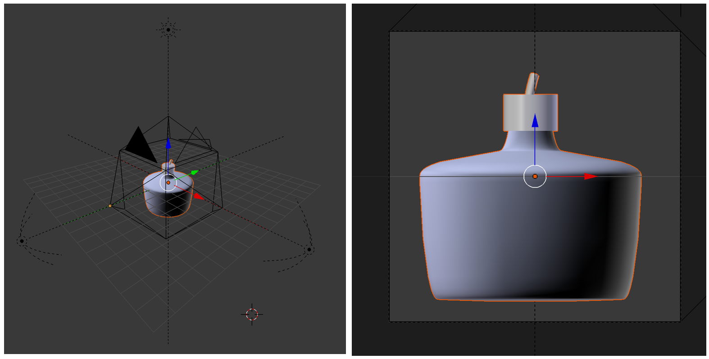
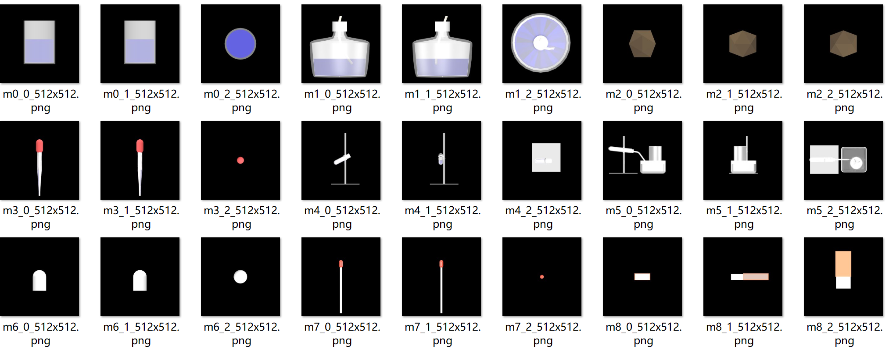
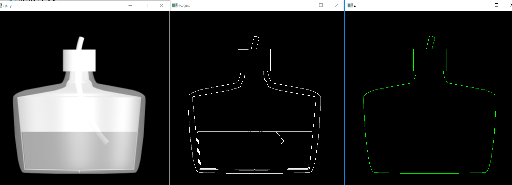
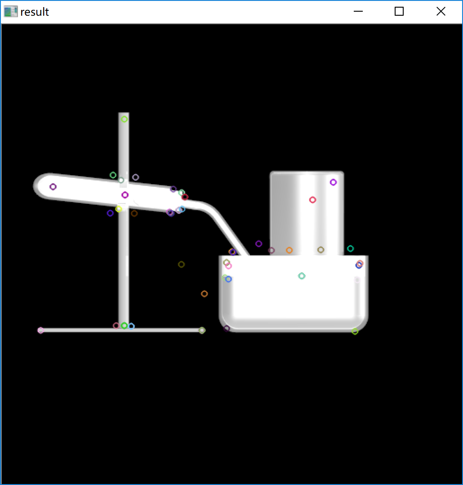
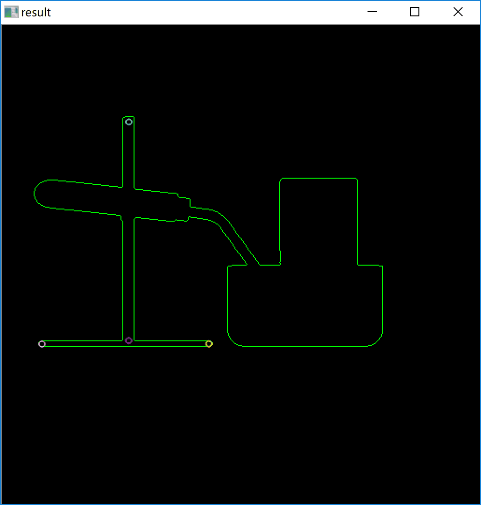
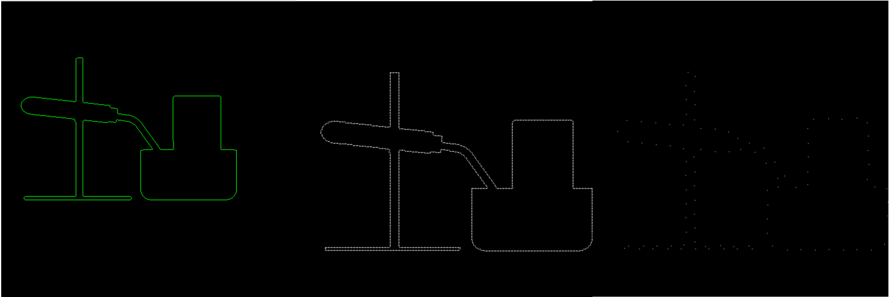
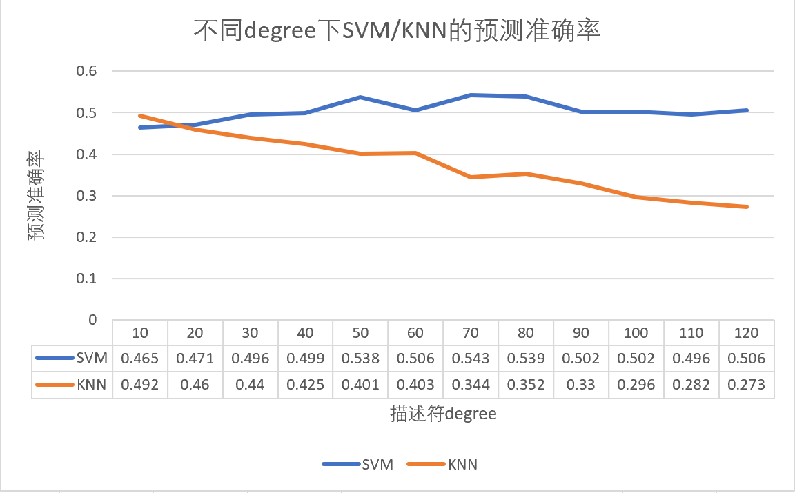

# 模型检索

## 一、模型三视图渲染

### 1. Blender场景

- 场景文件：`render_tool/render.blend`

- 场景设置：设置了3个Camera，分别拍摄模型的正视图/侧视图/俯视图

- 模型预处理：

  1. 因为原始模型的某些部分材质为玻璃或水，设置的透明度比较高，渲染时无法显示出模型轮廓，因此对模型进行了加工，调整了部分材质的高光/透明度/颜色参数设置
  2. 为了渲染出大小合适的图像，对模型的中心和尺度进行了调整

  

### 2. Python脚本

- 脚本文件：`render_tool/render.py`

- 作用：使用python脚本打开blender场景文件，load模型，进行渲染设置，然后输出三视图图片

  ```python
  ...
  
  # open render file
  bpy.ops.wm.open_mainfile(filepath=renderfile_path)
  
  # load model
  bpy.ops.import_scene.fbx(filepath = model_location)
  bpy.ops.object.select_all(action='DESELECT')
  
  # select model and join
  for ob in bpy.context.scene.objects:
      if ob.type == 'MESH':
          ob.select = True
          bpy.context.scene.objects.active = ob
      else:
          ob.select = False
  
  ...
  
  # move to origin point 
  bpy.context.object.location[0] = 0
  bpy.context.object.location[1] = 0
  bpy.context.object.location[2] = 0
  
  
  # render image, (four channel: R/G/B/Trans)
  for m in range(3): # 三视图：正面/侧面/俯视
      if m==0:
          bpy.context.scene.camera = bpy.data.objects['Camera']
      else:
          bpy.context.scene.camera = bpy.data.objects['Camera.%03d' %m ]
      bpy.context.scene.render.resolution_x = resolution_x
      bpy.context.scene.render.resolution_y = resolution_y
      bpy.data.scenes["Scene"].render.alpha_mode = 'TRANSPARENT'
      bpy.data.scenes["Scene"].render.filepath = '{}m{}_{}_{}x{}.jpg'.format(output_dir, model_index, m, resolution_x, resolution_y)
      bpy.ops.render.render(write_still = True, use_viewport = True, layer=("0"))
  
  ```

### 3. MATLAB 脚本

- 脚本文件：`render_tool/render.py`
- 作用：根据分辨率和输入输出设置，调用python脚本对模型进行成批渲染

### 4. 渲染成果

- 文件：`render_output/*.png`

- 渲染图片：

  

## 二、视图特征提取

### 尝试1. Canny 算子提取轮廓特征

由于VR中的手绘草图只有线条信息，不具有颜色信息，因此我们首先尝试了使用**Canny边缘检测算法**提取视图中的轮廓特征

- 代码文件：`Edge Detect/detect_edge.py`

- 检测效果：

  

  从左至右是均值滤波之后的 灰度图像 / Canny检测边缘 / 外轮廓

- 效果分析：可以看到图片内外层的轮廓都被很好的识别了出来，但是由于Canny输出的edge是一张二值图像，大小也和原始图像相关，所以还需要进行二次的特征提取，这个过程就比较麻烦；此外，由于用户绘制的草图一般是比较粗略的，复杂的内外轮廓在匹配是反而会造成干扰。

综上所述，我们放弃了使用Canny算子提取特征

### 尝试2. SIFT特征提取

考虑到**SIFT（Scale-invariant feature transform）**特征具有尺度不变性，而且即使改变旋转角度，图像亮度或拍摄视角，仍然能够得到好的检测效果，符合我们在输入端和数据库具有不同尺度的图片这一现实情况，我们尝试了提取图片的SIFT特征

- 代码文件：`sift/test.py`

- 对原始视图图片检测结果：

  

  可以看到，在background和一些反光的部分识别出了key point，这些特征是无法与VR端的简笔画进行匹配的，因此，我们考虑对图片进行一定的预处理，去除高光等因素的干扰。由于轮廓是最接近简笔画的信息，我们尝试了对模型的轮廓进行SIFT检测

- 对轮廓的检测结果：

  

  可以看到，key point少了很多，而且没有包含整个轮廓区域。我们思考认为是SIFT在形成特征点时需要轮廓之外的颜色等信息，这样的特征不适用于我们的场景，因此我们放弃了SIFT特征

### 尝试3. Fourier Descriptor

**傅里叶描述符（Fourier Descriptor）**将物体的形状看做是一条封闭的曲线，称为边界曲线。把曲线上的点`(x,y)`表示为复数形式`（x+yi）`，就可以把边界曲线看作描述点变化的周期函数，这个函数用傅里叶级数展开，将得到一系列复数形式的系数，它们共同描述了边界的形状

由于傅里叶描述符能很好的表示轮廓的特征，还具有尺度不变性和旋转角度不变性，并且能很方便的进行特征的匹配，我们尝试了使用傅里叶描述符来提取视图的特征

- 代码文件：`Fourier-Shape-Descriptors/FourierDescriptor.py`

  先提取图片的轮廓曲线，然后将曲线中的点坐标表示为`x+yi`形式，对复数点集进行傅里叶展开，这样就得到了原始的傅里叶描述符

  ```python
  def findDescriptor(img, resolution):
      """ findDescriptor(img) finds and returns the
      Fourier-Descriptor of the image contour"""
      # convert to gray image
      imgray = cv.cvtColor(img, cv.COLOR_BGR2GRAY)
      
      # threshold
      ret, thresh = cv.threshold(imgray, 1, 255, 0)
  
      # detect contours
      contour, hierarchy = cv.findContours(
          thresh,
          cv.RETR_EXTERNAL,
          cv.CHAIN_APPROX_NONE)
  
      print contour[0].shape
      contour_array = contour[0][:, 0, :]
      # print contour_array.shape
      # contour_array = reconstruct_contour(contour_array, resolution)
      # print contour_array.shape
  
      contour_complex = np.empty(contour_array.shape[:-1], dtype=complex)
      contour_complex.real = contour_array[:, 0]
      contour_complex.imag = contour_array[:, 1]
      fourier_result = np.fft.fft(contour_complex)
      return fourier_result
  ```

  由于轮廓曲线中的点比较密集，所以得到的描述符的degree也比较高，所以可以对描述符进行重建，降低degree，方便减少存储的空间，也利于特征匹配

  ```python
  def truncate_descriptor(descriptors, degree):
      """this function truncates an unshifted fourier descriptor array
      and returns one also unshifted"""
      descriptors = np.fft.fftshift(descriptors)
      center_index = len(descriptors) / 2
      descriptors = descriptors[
          center_index - degree / 2:center_index + degree / 2]
      descriptors = np.fft.ifftshift(descriptors)
  
      return descriptors
  ```

- 对提取的描述符进行逆变换之后可以得到轮廓曲线，效果如下：

  

  从左至右是 原始轮廓 / 高度数描述子逆变换轮廓 / 低度数描述子逆变换轮廓

可以看到提取效果良好，描述子也可以很方便的存储为npy数组文件格式，因此我们决定使用傅里叶轮廓描述符进行特征提取

## 三、视图特征匹配

### 1. 匹配算法

我们尝试两种特征匹配方法：

1. 把匹配问题看作一个分类问题，使用**支持向量机（Support Vector Machine, SVM）**对输入的数据分类到不同的模型
2. 使用**K最近邻(kNN，k-NearestNeighbor)分类算法**，使用最近的K个邻居的类别作为输入的类别

#### 尝试1. SVM

- 代码文件：`Fourier-Shape-Descriptors/main.py`

  ```python
  def SVM(training_set, response, test_set, answer):
      svm_model = cv.ml.SVM_create()
      # set up parameters for SVM
      svm_model.setKernel(cv.ml.SVM_LINEAR)
      svm_model.setType(cv.ml.SVM_C_SVC)
      svm_model.setC(2.67)
      svm_model.setGamma(5.383)
      svm_model.train(training_set, cv.ml.ROW_SAMPLE, response)
  
      answer_SVM = svm_model.predict(test_set)
      answer_SVM = np.array(answer_SVM)[1]
      #print answer_SVM
      answer = answer.reshape(TRAINING_SIZE,1)
      #print answer
      success_rate_SVM = np.count_nonzero(answer_SVM==answer) *1.0/ TRAINING_SIZE
      
      return success_rate_SVM 
  ```

#### 尝试2.KNN

- 代码文件：`Fourier-Shape-Descriptors/main.py`

  ```python
  def KNN(training_set, response, test_set, answer):
      knn = cv.ml.KNearest_create()
      knn.train(training_set, cv.ml.ROW_SAMPLE,response)
      ret, answer_KNN, neignbours, distance = knn.findNearest(test_set, 3)
      answer = answer.reshape(TRAINING_SIZE,1)
  
      success_rate_KNN = np.count_nonzero(answer_KNN==answer) *1.0/ TRAINING_SIZE
      return success_rate_KNN
  ```

### 2. 匹配测试

由于目前没有足够的训练数据，我们对20个模型的正视图提取了描述符，然后对描述符增加高斯噪声来生成训练和测试数据

```python
def addNoise(descriptors):
    """this function adds gaussian noise to descriptors
    descriptors should be a [N,2] np array"""
    scale = descriptors.max() / 10
    noise = np.random.normal(0, scale, descriptors.shape[0])
    noise = noise + 1j * noise
    descriptors += noise


def sample_generater(descriptors):
    """this function generates training_set, also for testing"""
    response = np.arange(MODEL_NUM)
    response = np.tile(response, TRAINING_SIZE / MODEL_NUM)
  
    training_set = np.empty(
        [TRAINING_SIZE, MIN_DESCRIPTOR], dtype=np.float32)
    # assign descriptors with noise to our training_set
    for i in range(TRAINING_SIZE / MODEL_NUM):
        for j in range(MODEL_NUM):
            descriptors_sample = descriptors[j].copy()
            addNoise(descriptors_sample)
            training_set[i*MODEL_NUM + j] = np.absolute(descriptors_sample)
        
    return training_set, response
```

设置训练集和测试集的大小为2000（每个模型有100个样本），在不同描述符degree下分类的粗略结果如图表所示：



对此测试结果，我们分析如下：

1. degree对分类准确度有较大影响，后续需要调整合适的训练参数

2. 目前的准确率都比较低，但是考虑到随机样本的不真实性，我们打算后续使用手绘简笔画进行进一步的测试和调整