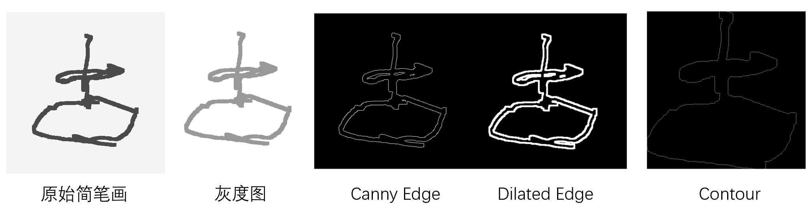
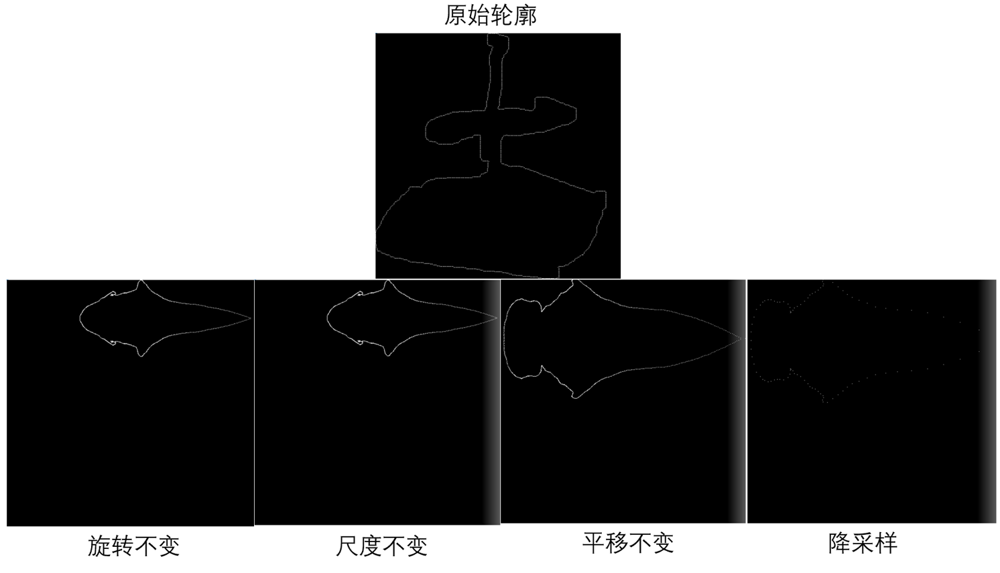

# README

## 一、简介

该部分用于提取模型图片和简笔画的Fourier轮廓描述符，并进行匹配

- **/code**：代码
  - `FourierDescriptor.py`：Fourier轮廓描述符提取
  - `search.py` ：轮廓特征匹配
  - `addDescriptor.py`：添加描述符到数据库
- **/data**：描述符数据
- **/pics**：简笔画图片
- **/visualization**：描述符可视化结果

## 二、 使用方法

- 环境：python2

- 库：numpy，openCV

- 获得简笔画的匹配结果：

  ```cmd
  PROJ\code>python2 search.py -h
  usage: search.py [-h] [-f FIGURE_NAME] [-n CAND_NUM] [-I]
  
  optional arguments:
    -h, --help      show this help message and exit
    -f FIGURE_NAME  Stick figure name
    -n CAND_NUM     Candidate model number
    -I              Whether to initiate model descriptor
  ```

- 把某个简笔画图片的描述符添加到描述符数据库：

  ```cmd
  PROJ\code>python2 addDescriptor.py -h
  usage: addDescriptor.py [-h] [-f FIGURE_NAME] [-n CLASS_ID]
  
  optional arguments:
    -h, --help      show this help message and exit
    -f FIGURE_NAME  Stick figure name
    -n CLASS_ID     Class ID
  ```

  

## 三、实现介绍

### 1. 基本流程

特征匹配的过程简述如下

```python
Step1：提取图片的轮廓
Step2：提取轮廓的傅里叶描述子
Step3：对傅里叶描述子进行旋转/平移/缩尺度不变性变换
Step4：对傅里叶描述子进行降采样
Step5：计算描述子和数据库中数据的L1距离，返回最近的前k个分类结果
```

### 2. 轮廓提取

```python
def findContour(img):
    # convert to gray image
    imgray = cv.cvtColor(img, cv.COLOR_BGR2GRAY)    

    # edges
    edges = cv.Canny(imgray, 30, 40)

    # threshold
    ret, thresh = cv.threshold(edges, 1, 255, 0)
    
    # dilation    
    kernel = np.ones((5,5),np.uint8)  
    dilation = cv.dilate(thresh,kernel,iterations = 1)

    # detect contours
    contour, hierarchy = cv.findContours(
        dilation,
        cv.RETR_EXTERNAL,
        cv.CHAIN_APPROX_NONE)

    return contour[0]
```



### 3. Fourier Descriptor

```python
def getFourierDescriptor(img, degree):
    init_fDesc = findDescriptor(img)	# 原始描述子
    rot_fDesc = rotataionInvariant(init_fDesc.copy())	# 旋转不变
    scale_fDesc = scaleInvariant(rot_fDesc.copy())		# 尺度不变
    trans_fDesc = transInvariant(scale_fDesc.copy())	# 平移不变
    trunc_fDesc = truncate_descriptor(trans_fDesc.copy(), degree)	# 降采样

    return trunc_fDesc
```



