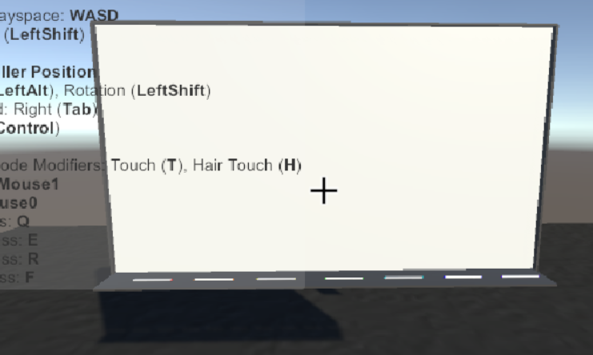

## VR端设计

### 设计考虑
在开题报告中我们考虑到，用户在三维空间中更方便进行三维的绘图，于是决定使用tilt brush在unity中进行开发。但在实践阶段遇到了两个问题：
1.  tilt brush 相关教程较少，他更多是一个开发好了的绘图工具，与unity整合在一起获取画出的模型资源有难度。
2. 在开题阶段就发现的，三维模型的绘制会出现从不同视角看过去差别较大的情况。考虑到大部分未经过训练的用户更习惯于普通的在画纸上进行二维创作的习惯，在实践中也会习惯在三维空间里画二维图像（也就是物体的主视图）。而此时二维图像的线段容易不在一个平面内，考虑过的多视图加权计算思路操作起来并不容易。（此处加图）

综合以上考虑，为了在中期能够收获一个实验结果，在VR端的设计上做出了改动：在空间中固定一个画板，为用户提供一个可参考的二维平面，然后提供画笔让用户进行绘画。

### 设计思路
#### 1. 黑板作为二维绘画载体
定义了一个黑板（在场景中建一个Quad）和许多画笔。画笔的设计上有些复杂，分为笔的头、尾（控制握笔的方向）还有笔尖（用来绘画）。在画笔触碰到黑板时触发函数记录画笔此刻的位置并将此处的像素点设置颜色，然后实时更新黑板面的texture来显示绘画图案。（画笔图、黑板图、绘制图）



- 关于像素点绘制：
    其实这个功能很简单，只是简单的运用Unity Texure2D类中的两个函数：

    ```
     public void SetPixels32(int x, int y, int blockWidth, int blockHeight, Color32[] colors, int miplevel = 0);
     ```
     
     前面4个参数相当于一个矩形，x和y就是矩形的左下角的那个点，blockWidth和blockHeight分别是矩形的宽和高，这个矩形所代表的范围就是blockWidth*blockHeight个像素所在的位置，不妨称这个矩形范围为一个色块；
     
     colors这个参数的大小必须等于blockWidth*blockHeight，因为这个方法就是给坐标(x,y)开始，从左到右，从下到上，一行一行的对矩形范围内的每个像素赋值；
     
     也就是把colors[0]~colors[blockWidth - 1]分别赋值到坐标为(x,y)~(x + blockWidth，y)的像素，以此类推；

    ```
     public void Apply(bool updateMipmaps = true, bool makeNoLongerReadable = false);
    ```

     当对图片改动完成以后，需要调用这个方法，才能让改动真正的应用在图片上；

     最后一个参数，因为我们用的图片把Generate Min Maps这个选项关闭了，所以用默认的可选参数0；
     
     ```
     public void Apply(bool updateMipmaps = true, bool makeNoLongerReadable = false);
     ```
     
     当对图片改动完成以后，需要调用这个方法，才能让改动真正的应用在图片上；


相关代码片段
```绘制部分核心代码
here
```

#### 2. 设计升级
1. 前面为了让黑板能够绘制图像，board的collider不能设置为box而是设置为mesh，因此会造成笔能穿过黑板的问题。这样会给绘画带来许多不方便之处，不符合人机交互的思想。为了让我们的交互更加符合真实场景，我们给绘画加入一个防止画笔穿过黑板的功能。

设计的基本思路是
通过检测笔在画板哪一侧来限制笔的位置。

- 首先给黑板增加一个Plane类型的字段

    Plane这个类中有两个方法：

    ``` cs
       public bool GetSide(Vector3 inPt); //判断一个点在Plane的哪一侧
    ```

    Plane把一个空间分成了两部分，当一个点在Plane的normal（法线）指向的一侧的时候，这个值返回True，否则返回False；

    ```cs
    public float GetDistanceToPoint(Vector3 inPt);//判断一个点距离平面的距离，这个值是带符号的，当点在平面的正面的时候，返回正值，否则返回负值；
    ```
    利用这两个方法可以判断出笔尖是不是穿透了画板，并且可以等到笔尖穿透的距离，从笔尖的位置减去这个距离，则刚好可以让笔尖处于平面上；

    在之前的board类中添加
    ```cs
     public bool GetSideOfBoardPlane(Vector3 point)
    {
        return boardPlane.GetSide(point);
    }

    public float GetDistanceFromBoardPlane(Vector3 point)
    {
        return boardPlane.GetDistanceToPoint(point);
    }
    /// 矫正后的笔尖应该在的位置
    public Vector3 ProjectPointOnBoardPlane(Vector3 point)
    {
        float d = -Vector3.Dot(boardPlane.normal, point - transform.position);
        return point + boardPlane.normal * d;
    }
    ```

- 对于穿透这种情况，没有一种是比较合适的，因此需要自己扩展一种抓附机制；上面的抓附机制都是直接或者间接继承自VRTK_BaseGrabAttach的，因为定义一个VRTK_InteractableObject的抓起方式的字段就是VRTK_BaseGrabAttach类型；

    添加一个新的脚本继承自VRTK_BaseGrabAttach：
    ```cs
    public class PainterGrabAttach : VRTK_BaseGrabAttach
    {
        private Transform tips;//笔尖
        private static Board board;//画板

        // 重写的父类方法
        protected override void Initialise()
        {
            //初始化父类的一些字段，这些字段只是标识这个抓附机制的作用
            //初始化自定义的属性
        }

        public override bool StartGrab(GameObject grabbingObject, GameObject givenGrabbedObject, Rigidbody givenControllerAttachPoint){ }

        public override void StopGrab(bool applyGrabbingObjectVelocity){}

        public override void ProcessFixedUpdate() {}


        //让手柄抓住物体
        private void SnapObjectToGrabToController(GameObject obj) {}

    //设置物体和手柄连接的位置 
        private void SetSnappedObjectPosition(GameObject obj){}
    }
    ```
2. 检索后的信息反馈

    这一部分一开始的设计是将检索端的返回信息用canvas来展示前五个模型的正视图，供用户选择，用户点击想要选择的模型便可以将模型加载到场景中使用。

    考虑到如果用户的绘画比较不准确，可能造成前五个返回信息中没有想要的模型，我们决定采用轮播框来对返回信息进行展示。

    轮播框的正中间显示检索匹配度最高的模型图片，其余模型图片按匹配度降序向两边分布，可见图片依然为5个。并且为了更加美观且体验友好的显示，我们将正中间的图片高亮显示，在上方渲染出该图片对应模型的360°旋转的动态效果。点击正中间的图片即可隐藏canvas，加载模型。

    如果所选的图片不在正中间，我们需要点击其他图片，这时轮播框将会转动，将我们选定的图片移到正中间进行高亮显示。

    由于非VR下的轮播框功能会有drag事件，让鼠标拖动轮播框左右移动，但是在VR下VR_UIDraggableItem组件会将这种拖动会变成对于整个轮播框的拖动，因此并不需要给canvas绑定此事件。

3. 更加友好的手柄交互体验
    在VR中我们主要通过手柄来进行各项操作。对于手柄交互的便捷性我们做出了如下改进：

    1. 我们在画完图像之后点击左手柄的trigger键便触发检索流程，此时黑板被隐藏，canvas被调出并显示检索结果。

    2. 在与UI的交互中，我们选择使用手柄射线远距离交互。需要给手柄加上VRTK_UIPionter，给canvas加上VRTK_UICanvas组件，这样便可应用右手柄的trigger键调出射线，用右手柄的grip键选中图片。

    这里要注意的一点是，射线也可以完成远距离的抓取功能，因此也可以用射线来控制画笔绘画，但是要去掉Grab to pointer tip的勾选，否则每次调用射线后再去抓取画笔，画笔都会记录射线的偏移量，使得我们没有办法与画笔保持一致。

    3. 我们可以用左手柄的grip键来重新调出黑板进行下一轮作画，此时的黑板已经被清空。我们还可以按压左手柄的touchpad来将不满意的绘画清空。

    4. 我们给画笔触碰到黑板的第一下加入了声响。这在一部分曾经尝试使用手柄震动，但震动会对绘画有一定的影响。此外长时间的接触声响也会影响用户体验，因此我们在每一笔第一次触碰黑板时才发出碰撞声响，提示用户画笔已经就位。


### 设计中的HCI思想：

1. 从用户的角度出发，考虑方便性：开题时考虑到在三维空间中画三维图更方便，于是设定了
**画三维图像→特征提取→转化为二维图像→匹配识别**
的流程。但是在实际的实践中，我们发现了上述的问题。
我们发现对于普通的中学生和老师，在未经训练的情况下，更习惯于在二维平面作画，也就是所谓的纸笔作画。三维空间中的凭空绘制虽然也并不难以学习，但是其稳定程度、作画的舒适感相对来说有些不符合人体工程学。这个时候我们从现实生活入手，考虑了用户群体的生活环境，发现黑板这样一个在三维空间中提供作画平台的工具在中学教室里非常常见，几乎每个人都有机会接触，也有过接触经验。在课程中我们讲到过人的记忆仓库会对一些长期存在的记忆有偏好，一些长期记忆会渐渐规则化、潜意识化。我们人机界面的设计原则中很重要的一点就是要减少学习适应的信息总量，使用用户更为熟悉的固有记忆。我们发现黑板作画放在我们的VR环境中会非常容易接受。

2. 去掉碰撞体按钮和UI按钮，让用户直接用手柄事件触发各项功能，不需要瞄准和位移，操作更加简洁。增加射线来进行必要的canvas互动，也符合人的一般习惯。

3. 信息的反馈和展示更加人性化。尽量保持场景的简单、物体的单一，让黑板和canvas能够隐藏和出现。对于检索反馈，给出多个选项来确保最终可以选到想要的模型。对于预选物体进行高亮和全角度展示，再次确保最终的选择正确。

4. 对于各功能的按键选择，我们在亲身试验中确保了按键的便捷性、以及确保各事件的互不冲突。选用最便捷的左右手的trigger、grip键进行主要功能的操作。