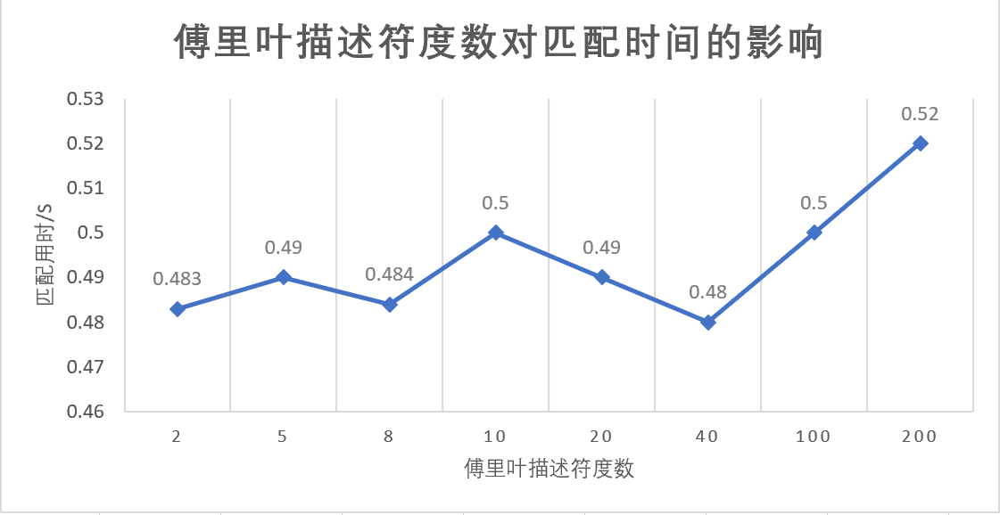
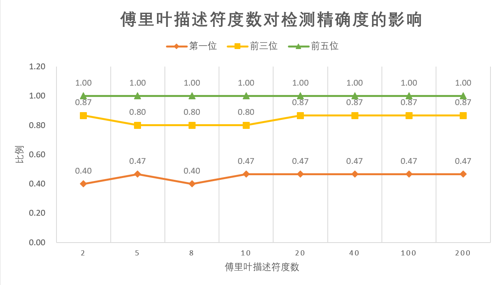

# 实验验证

对模型检索的准确性和时效性进行了实验验证

- 数据：
  - 使用已有的20个模型的正视图轮廓特征作为匹配数据库
  - 对VR端绘制得到的15张简笔画进行特征匹配
- 变量：
  - 不同描述符度数

- 测试指标：
  - 匹配用时
  - 正确结果在输出的排序结果中的位置

### 1. 测试结果数据

| 图像编号 | 2    | 5    | 8    | 10   | 20   | 40   | 100  | 200  |
| -------- | ---- | ---- | ---- | ---- | ---- | ---- | ---- | ---- |
| 0        | 2    | 2    | 2    | 1    | 1    | 1    | 1    | 1    |
| 1        | 0    | 0    | 0    | 0    | 0    | 0    | 0    | 0    |
| 3        | 1    | 1    | 1    | 1    | 2    | 2    | 2    | 2    |
| 4        | 4    | 4    | 3    | 3    | 3    | 3    | 3    | 3    |
| 5        | 2    | 0    | 0    | 0    | 0    | 0    | 0    | 0    |
| 7-1      | 0    | 0    | 0    | 0    | 0    | 0    | 0    | 0    |
| 7-2      | 2    | 3    | 3    | 3    | 2    | 2    | 2    | 2    |
| 8        | 1    | 1    | 2    | 2    | 2    | 2    | 2    | 2    |
| 9-1      | 0    | 0    | 0    | 0    | 0    | 0    | 0    | 0    |
| 9-2      | 1    | 1    | 0    | 1    | 1    | 1    | 1    | 1    |
| 10       | 0    | 0    | 0    | 0    | 0    | 0    | 0    | 0    |
| 13       | 2    | 1    | 1    | 1    | 1    | 1    | 1    | 1    |
| 14       | 4    | 4    | 4    | 4    | 4    | 4    | 4    | 4    |
| 15       | 0    | 0    | 1    | 0    | 0    | 0    | 0    | 0    |
| 17       | 0    | 0    | 1    | 0    | 0    | 0    | 0    | 0    |

- 第一列表示图像编号，数字表示类别
- 第一行表示傅里叶描述符度数
- 单元格中的数字表示正确模型在匹配排序结果中的pos
  - 0表示最匹配，数字越大表示偏离越大

### 2. 分析数据

| 度数    | 2        | 5        | 8     | 10       | 20       | 40       | 100      | 200      |
| ------- | -------- | -------- | ----- | -------- | -------- | -------- | -------- | -------- |
| avg pos | 1.266667 | 1.133333 | 1.2   | 1.066667 | 1.066667 | 1.066667 | 1.066667 | 1.066667 |
| 用时/s  | 0.483    | 0.49     | 0.484 | 0.5      | 0.49     | 0.48     | 0.5      | 0.52     |
| pos=0   | 0.40     | 0.47     | 0.40  | 0.47     | 0.47     | 0.47     | 0.47     | 0.47     |
| pos<3   | 0.87     | 0.80     | 0.80  | 0.80     | 0.87     | 0.87     | 0.87     | 0.87     |
| pos<5   | 1.00     | 1.00     | 1.00  | 1.00     | 1.00     | 1.00     | 1.00     | 1.00     |

- avg pos：平均检索结果中正确模型的位置
- 用时：匹配15个模型的总耗时
- 后三行：pos为0，小于3，或小于5的概率

### 3. 分析结果

#### 3.1 对匹配时间的影响

- 可见时间都在0.5s左右
- 这是匹配15个模型的总用时，单个模型的话会略短一些
- 可以认为满足时效性的要求，在实际运行时模型检索耗时不会影响用户的体验

#### 3.2 对准确度的影响

- 15个简笔画检索出的正确模型出现在前五个的几率是百分之百
  - 可以在轮播框的直接显示结果中选中目标模型
- 描述符度数>10之后，检索的精度就不再提升
- 可以认为满足准确性的要求，实际运行时基本不需要切换轮播框页，就可以得到正确的模型