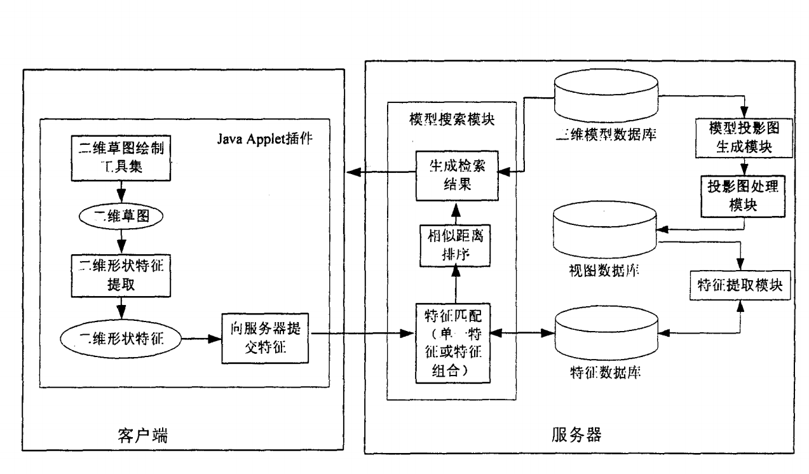
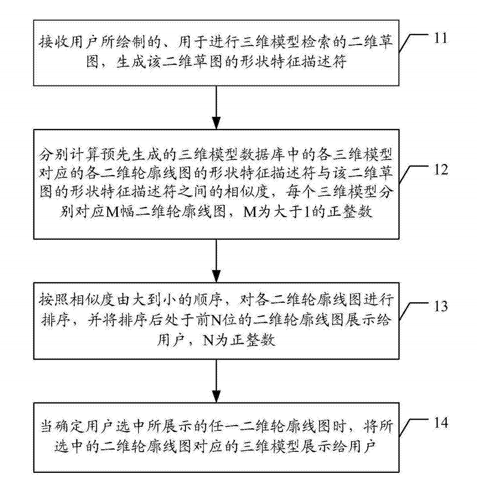

### 基于二维草图的三维模型检索方法1

- [论文链接](https://patents.google.com/patent/CN101004748A/zh)

- 基本方法：

  1. 预先对三维模型数据库进行处理。首先由**三维模型数据库**得到**视图数据库**，然后计算每幅视图的特征，最终生成**特征数据库**，

  2. 检索系统的客户端提取**二维草图**的**形状特征**，并将特征提交给服务器，服务器端程序首先将草图的特征与特征数据库中的**特征匹配**，匹配时根据草图特征的种类，选择不同的算法计算二维草图与每个三维模型的**相似距离**；

  3. 将**相似距离排序**，根据系统指定的首页显示模型数，将排序靠前的三维模型的位次、索引图象、URL等，返回给客户端

     

- 流程图

  

- 特征提取
  1. 计算视图的**Zernike矩特征**
  2. 计算傅里叶轮廓描述符作为**轮廓特征**

- 特征匹配
  1. 计算草图的两种特征
  2. 计算草图特征和数据库中每个模型的3个视图特征的相似距离，取**最小值**来度量与该模型的相似距离
  3. 对两种相似距离都使用快排进行排序
  4. 根据需要对两种特征距离进行加权再排序，返回距离升序模型序列

### 基于二维草图的三维模型检索方法2

- [论文链接](https://patents.google.com/patent/CN106484692A/zh)

- 基本方法：

  1. 接收用于进行三维模型检索的二维草图，生成所述**二维草图的形状特征描述符**；
  2. 分别计算三维模型数据库中的**各三维模型对应的各二维轮廓线图的形状特征描述符**与所述二维草图的形状特征描述符之间的相似度，每个三维模型分别对应M幅二维轮廓线图，M为大于1的正整数；
  3. 按照相似度由大到小的顺序，对各二维轮廓线图进行**排序**，并将排序后处于前N位的二维轮廓线图展示给用户，N为正整数；当确定**用户选中**所展示的任一二维轮廓线图时，将所选中的二维轮廓线图对应的三维模型展示给用户。

- 流程图：

  

- 三维模型的二维特征：
  1. 生成三维模型在M个视点上的**二维深度图像**
  2. 生成各二维深度图像对应的**二维轮廓线图**
  3. 生成二维轮廓线图的**特征描述符**
- 特征描述符
  1. 对二维图像在P个预定方向上施加**Gabor滤波**
  2. 对每个滤波图像均匀取**Y个采样点**，在Y个局部区域内划分层次结构计算出**形状梯度直方图HOG**
  3. 将P个滤波图像中同一采样区域的HOG顺序连接，得到**Y个特征向量**