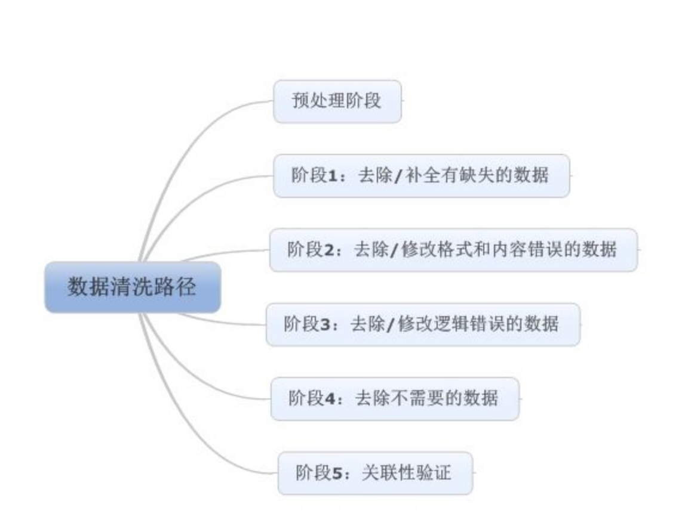

# 可能用到的技术

## 数据清洗

- 含义：数据清洗(Data cleaning)– 对数据进行重新审查和校验的过程，目的在于删除**重复信息**、纠正存在的**错误**，并提供**数据一致性**。

- 流程：

  

## 图像分割

### 1. 含义

在计算机视觉领域，图像分割（Segmentation）指的是将数字图像细分为多个图像子区域（像素的集合）（也被称作超像素）的过程。图像分割的目的是简化或改变图像的表示形式，使得图像更容易理解和分析。

图像分割通常用于定位图像中的物体和边界（线，曲线等）。更精确的，图像分割是对图像中的每个像素加标签的一个过程，这一过程使得具有相同标签的像素具有某种共同视觉特性。

图像分割的结果是图像上子区域的集合（这些子区域的全体覆盖了整个图像），或是从图像中提取的轮廓线的集合（例如边缘检测）。一个子区域中的每个像素在某种特性的度量下或是由计算得出的特性都是相似的，例如颜色、亮度、纹理。邻接区域在某种特性的度量下有很大的不同。

### 2. 方法

1. 聚类法
2. 直方图法
3. 边缘检测
4. 区域生长
5. 水平集方法

## 特征提取

### 1. 含义

**特征提取**是计算机视觉和图像处理中的一个概念。它指的是使用计算机提取图像信息，决定每个图像的点是否属于一个图像特征。特征提取的结果是把图像上的点分为不同的子集，这些子集往往属于孤立的点、连续的曲线或者连续的区域。

**局部特征**从总体上说是图像或在视觉领域中一些有别于其周围的地方；局部特征通常是描述一块区域，使其能具有高可区分度；局部特征的好坏直接会决定着后面分类、识别是否会得到一个好的结果。

### 2.常用特征

- **Zernike矩特征**：Zernike矩是基于 Zernike多项式的正交化函数，具有旋转不变性的特性。Zernike矩是复数矩 ,一般把 Zernike矩的模作为特征来描述物体形状。1个目标对象的形状特征可以用 1组很小的 Zernike矩特征向量很好的表示。
- **傅里叶轮廓描述符**：傅里叶形状描述子将物体的形状看做是一条封闭的曲线，称为边界曲线，这条边界曲线可以认为是动点*P(l)*在以边界曲线周长为循环的循环运动，*x(1)+iy(l)*可以看做是P点坐标的变化的周期函数，这个函数用傅里叶级数展开，展开的傅里叶系数是一系列与边界有关的数据，将这些数据成为其傅里叶描述子。
- **形状梯度直方图HOG**：HOG特征是一种在计算机视觉和图像处理中用来进行物体检测的特征描述子。它通过计算和统计图像局部区域的梯度方向直方图来构成特征。

### 3.提取方法

- 主成分分析（PCA）
- 线性判别分析（LDA）
- 多维尺度分析（MDS）
- 独立成分分析（ICA）

## 特征匹配

特征点之间的匹配过程其实就是特征向量之间的距离计算。

常用的距离有 欧式距离、汉明距离、余弦距离 等等。

通常来讲，两个图片之间特征向量之间的匹配过程 每个图片1的向量都要和 图片2的向量去进行距离的计算，进而得出两个图片特征点之间的距离关系。

## 神经网络

神经网络是一种运算模型，由大量的节点（或称神经元）之间相互联接构成。每个节点代表一种特定的输出函数，称为激励函数（activation function）。每两个节点间的连接都代表一个对于通过该连接信号的加权值，称之为权重，这相当于人工神经网络的记忆。网络的输出则依网络的连接方式，权重值和激励函数的不同而不同。而网络自身通常都是对自然界某种算法或者函数的逼近，也可能是对一种逻辑策略的表达。

最近十多年来，人工神经网络的研究工作不断深入，已经取得了很大的进展，其在模式识别、智能机器人、自动控制、预测估计、生物、医学、经济等领域已成功地解决了许多现代计算机难以解决的实际问题，表现出了良好的智能特性。