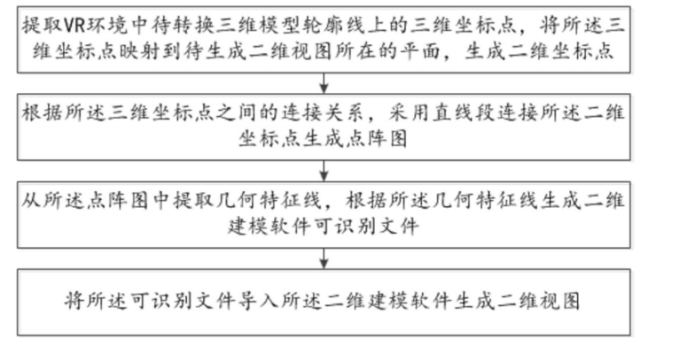
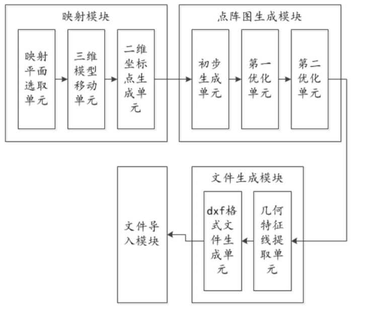

# 基于VR环境二维视图生成方法及系统

## 流程

1. 提取VR环境中带转换三维模型轮廓线上的三维坐标点，将所述三维坐标点映射到待生成二维视图所在的平面，生成二维坐标点；
2. 根据三维坐标点之间的连接关系，采用直线段连接所述二维坐标点生成点阵图；
3. 从所述点阵图中提取几何特征线，根据所述几何特征线生成二维建模软件可识别文件；
4. 将所述可识别文件导入所述二维建模软件生成二维视图。

## 模块

1. 映射模块

   用于于提取VR环境中待转换三维模型轮廓线上的三维坐标点，将所述三维坐标点映射到待生成二维视图所在的平面，生成二维坐标点；

2. 点阵图生成模块

   用于根据所述三维坐标点之间的连接关系，采用直线段连接所述二维坐标点生成点阵图；

3. 文件生成模块

   用于从所述点阵图中提取几何特征线，根据所述几何特征线生成二维建模软件可识别文件；

4. 文件导入模块

   用于将所述可识别文件导入所述二维建模软件生成二维视图。

其中需要注意的是：

1. 映射平面只选取了:x=0, y=0, z=0三个平面，然后通过三维模型移动单元来对VR环境中的三维模型进行旋转、平移等操作。

2. 初步生成单元：

   根据三维坐标点之间的连接关系直接连线生成点阵图

3. 第一优化单元：

   判断所述点阵图中是否存在依次具有连接关系且共线的二维坐标点组成的二维坐标点组，是，则去除位于所述二维坐标点组内部的二维坐标点，并采用直线段直接连接位于所述二维坐标点组两端的二维坐标点；否，则驱动第二优化单元工作；

4. 第二优化单元：

   于判断所述点阵图中是否存在重合的直线段组成的直线
   段组，是，则去除位于所述直线段组内部的二维坐标点，并采用直线段直接连接位于所述直
   线段组两端的二维坐标点；否，则驱动文件生成单元工作。

5. 几何特征提取单元：

   从所述点阵图中提取几何特征线，所述几何特征线包括直线段、弧线段和/或圆；

6. 述dxf格式文件生成单元：

   用位于所述直线段两端的二维坐标点的坐标表征所述直线段；根据位于所述弧线段的二维坐标点生成所述弧线段的第一圆心坐标、第一半径及起点和终点坐标，并用所述第一圆心坐标、第一半径及起点和终点坐标表征所述弧线段；根据位于所述圆的二维坐标点生成所述圆的第二圆心坐标及第二半径，并用所述第二圆心坐标及第二半径表征所述圆；生成dxf格式的二维建模软件可识别文件。

## 参考
1. [基于VR环境二维视图生成方法及系统](http://cprs.patentstar.com.cn/Search/Detail?ANE=9FCA7AHA9HHG9FCF9IHH9DIC9CID9CGA9ECA8DCA3BCA9EFF)