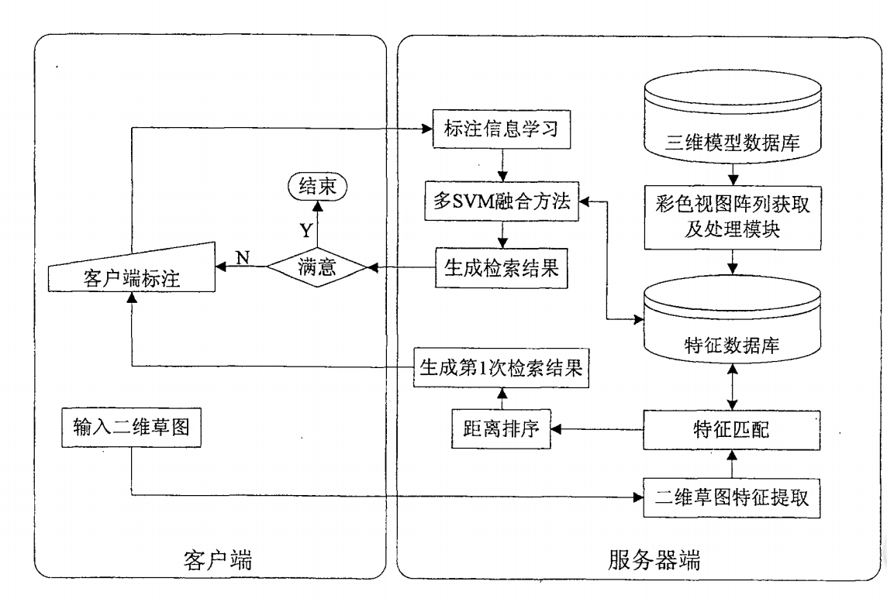

### 基于多特征相关反馈的三维模型检索方法

- [论文链接](https://patents.google.com/patent/CN100593785C/zh)

- 基本方法：

  1. 对三维模型数据库中的每个三维模型进行处理，获取三维模型的彩色视图阵列
  2. 获取三维模型特征，合并所有三维模型特征生成特征数据库
  3. 计算客户端提供的二维草图的特征
  4. 计算该二维草图与每个三维模型的距离，并和特征数据库中特征进行匹配，对所有三维模型按照距离值排序并输出，生成检索结果
  5. 由客户端对每次检索结果进行“相关”及“不相关”的标注，将标注后的三维模型信息返回服务器端，服务器端对该信息进行学习，采取多SVM融合方法对所述三维模型库进行分类，根据分类结果对所有三维模型进行排序并输出，作为检索结果
  6. 重复步骤5，最终输出用户满意的三维模型检索结果。

- 流程图

  

- 特征提取

  1. 使用**图像分割**算法得到彩色视图的轮廓
  2. 计算轮廓的**傅里叶描述符**作为轮廓描述符
  3. 应用**系统聚类**方法进行无监督聚类，获得K个分类
  4. 对每个分类应用**贝叶斯信息度量**准则，选每分类中BIC值最大的轮廓描述符对应的彩色视图作为模型的“典型视图”之一
  5. 计算K个“典型视图”的颜色/轮廓特征
  6. 通过**贝叶斯网络**学习生成纹理特征
  7. 将每个模型的**轮廓/颜色/纹理特征**存入数据库

  