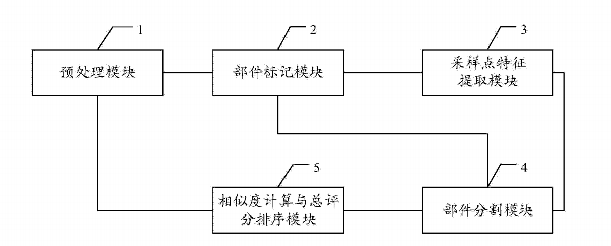

# 一种基于手绘草图部件分割的三维模型检索系统及方法

## 现有的三维模型检索方法

1. 基于文本
    不适应三维模型（缺号拓扑结构、形状特征等信息）  
    具有二义性  
2. 基于内容  
    对输入要求过高  

## 系统模块

1. 预处理模块：  
    处理手绘草图。  
    通过去噪、二值化、边界扩展、图像孔洞填充获得处理后的图片。  
2. 部件标记模块：  
    对处理后的草图进行等间隔采样，并对采样点添加部件标签。
3. 采样点特征提取模块：  
    用于提取所述采样点的各种特征向量。  
4. 部件分割模块：  
    根据添加部件标签后的采样点的各种特征向量来进行模型分割训练。  
5. 相似度计算与总评分排序模块：  
    用于基于分割模型进行部件局部特征提取及部件局部相似度计算。  
    对处理后的图像进行视图全局特征提取及视图全局相似度计算，按照总评分排序，并将排序结果返回给客户端。

## 具体实施方式

1. S501：由于用户草图往往不够准确，所以对手绘的查询草图进行必要的预处理

2. S502：采样并添加标签

   1. 对处理后的图像进行轮廓线提取
   2. 对提取轮廓线后的图像进行等间隔采样
   3. 对采样点添加部件标签

3. S503：采样点特征提取

   1. 一元特征提取单元

      单个采样点自身的一元特性（每个采样点内部的特征）：

      * 2D形状直径特征
      * 平均欧式距离特征
      * 形状上下文直方图特征
      * 所在连通分支比重特征

   2. 二元特征提取单元

      每个采样点与邻接采样点之间的标签一致性

4. S504：分割模型训练

   1. 分割模型训练单元
   2. 部件分割单元
   3. 采用条件随机场（CRF）模型进行分割模型的训练

5. S505：相似度计算

   1. 考虑部件之间的拓扑结构
   2. 考虑草图与模型之间view视角的相似度评分的计算公式

## 参考

1. [谷歌专利](https://patents.google.com/patent/CN104850633A/zh)
